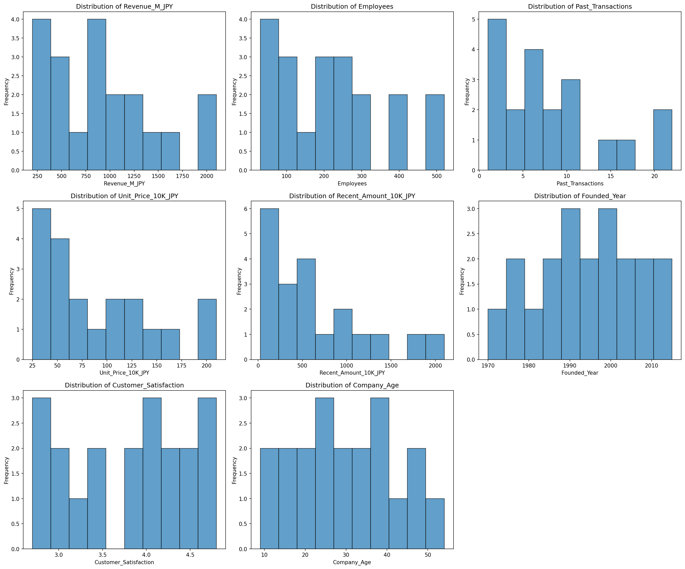
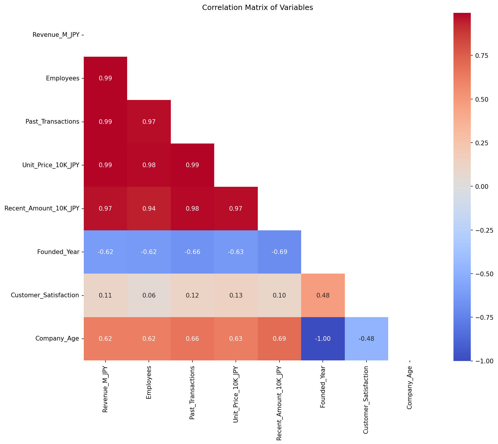
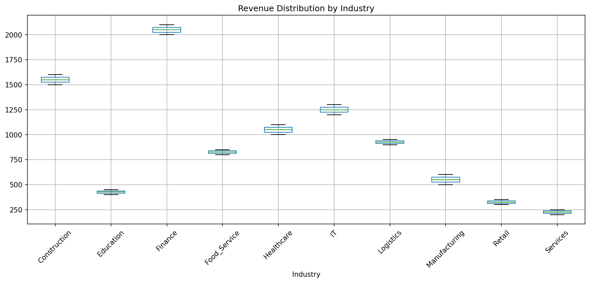
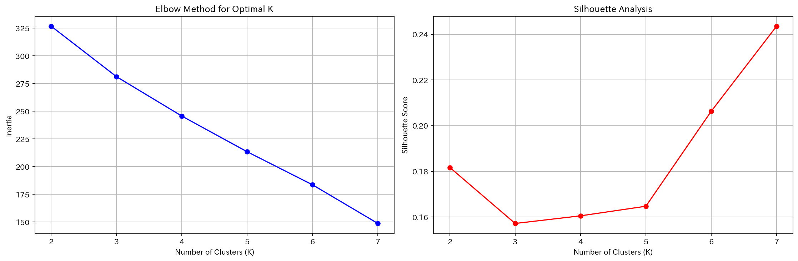
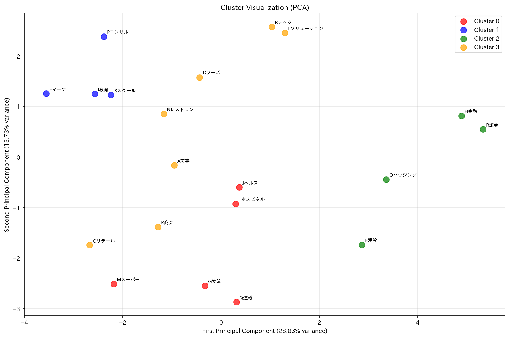
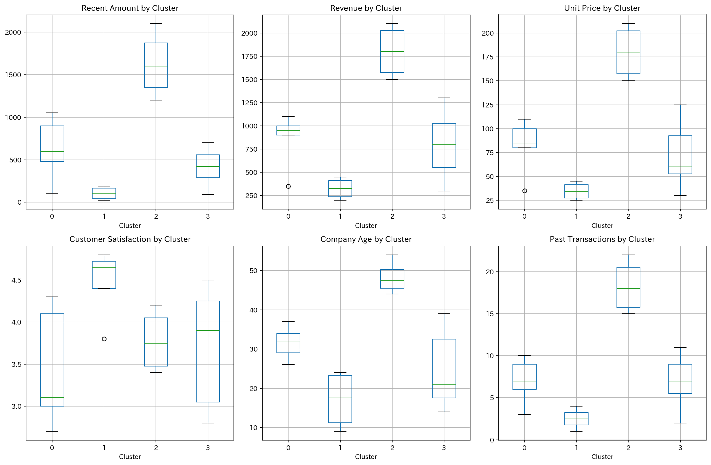
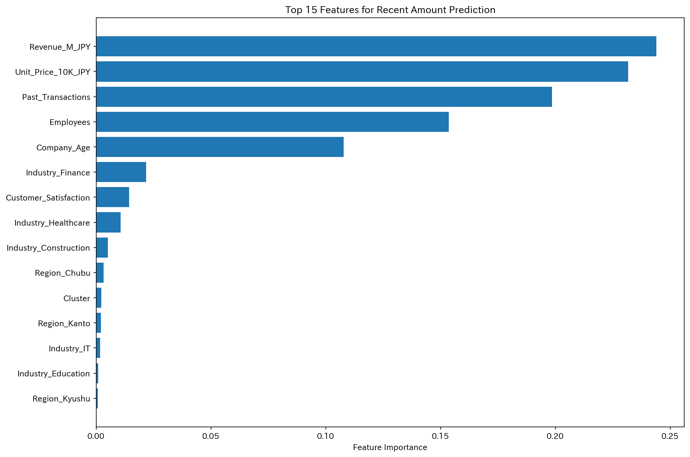

# 企業データ分析レポート：EDAからクラスター分析まで

## 1. データ概要

### データセット
- **企業数**: 20社
- **変数数**: 11変数（数値8変数、カテゴリ3変数）
- **欠損値**: なし
- **分析期間**: 2024年基準

### 変数一覧
| 変数名 | 説明 | 型 |
|--------|------|-----|
| Company | 企業名 | カテゴリ |
| Revenue_M_JPY | 売上(百万円) | 数値 |
| Industry | 業種 | カテゴリ |
| Employees | 従業員数 | 数値 |
| Past_Transactions | 過去取引回数 | 数値 |
| Unit_Price_10K_JPY | 取引単価(万円) | 数値 |
| Recent_Amount_10K_JPY | 直近取引金額(万円) | 数値 |
| Founded_Year | 設立年 | 数値 |
| Customer_Satisfaction | 顧客満足度 | 数値 |
| Region | 地域 | カテゴリ |
| Company_Age | 企業年数 | 数値(計算) |

## 2. 探索的データ分析（EDA）結果

### 2.0 データ分布可視化

*各変数の分布状況。売上・従業員数・取引金額は右裾が長い分布を示している。*

### 2.1 基本統計量
| 指標 | 売上(百万円) | 従業員数 | 直近取引金額(万円) | 顧客満足度 | 企業年数 |
|------|-------------|----------|------------------|-----------|---------|
| 平均 | 917.5 | 220.8 | 648.1 | 3.8 | 29.7 |
| 標準偏差 | 566.0 | 152.6 | 593.7 | 0.7 | 12.8 |
| 最小値 | 200.0 | 30.0 | 25.0 | 2.7 | 9.0 |
| 最大値 | 2100.0 | 520.0 | 2100.0 | 4.8 | 54.0 |

### 2.2 相関分析

*変数間の相関関係ヒートマップ。売上関連指標間で強い正の相関が確認される。*

**高相関グループ（0.94-0.99）**:
- 売上、従業員数、取引回数、取引単価、直近取引金額

**中程度相関（0.6前後）**:
- 企業年数と売上指標

**低相関（0.11）**:
- 顧客満足度と売上指標

### 2.3 業種・地域分布

*業種別の売上分布。金融業が最も高く、サービス業が最も低い。*

**業種別**: 各業種2社ずつ均等分布
- 金融：最大規模（平均売上2050百万円）
- 建設：2番目（平均売上1550百万円）
- サービス：最小規模（平均売上225百万円）

**地域別**:
- 関東：8社（40%）
- 関西：4社（20%）
- 中部・九州：各3社
- 中国：2社

## 3. クラスター分析

### 3.1 分析設定

*エルボー法とシルエット分析によるクラスター数決定。4クラスターを選択。*

- **手法**: K-means法
- **クラスター数**: 4（最適化後）
- **特徴量**: 21変数（数値6 + 業種ダミー10 + 地域ダミー5）
- **前処理**: 標準化実施
- **目的変数**: 直近取引金額の説明

### 3.2 クラスター特徴（直近取引金額順）

*PCAによるクラスター可視化。横軸：企業規模、縦軸：企業特性（新興高満足度 vs 老舗）*

*各クラスターの特性比較。クラスター2が全ての指標で最高値を示している。*

#### **Cluster 2: 大手企業層**
- **平均直近取引金額**: 1,625万円
- **企業**: E建設、H金融、Oハウジング、R証券
- **特徴**:
  - 建設・金融業中心
  - 関東立地
  - 老舗企業（平均48年）
  - 最高取引額層

#### **Cluster 0: 中堅企業層**
- **平均直近取引金額**: 626万円
- **企業**: G物流、Jヘルス、Mスーパー、Q運輸、Tホスピタル
- **特徴**:
  - 物流・医療・小売業
  - 中部・九州中心
  - 企業年数32年
  - 地域分散型

#### **Cluster 3: 一般企業層**
- **平均直近取引金額**: 416万円
- **企業**: A商事、Bテック、Cリテール、Dフーズ、K商会、Lソリューション、Nレストラン
- **特徴**:
  - 多様な業種
  - 関東中心（7社中4社）
  - 比較的若い企業（25年）
  - 最大グループ

#### **Cluster 1: 小規模企業層**
- **平均直近取引金額**: 105万円
- **企業**: Fマーケ、I教育、Pコンサル、Sスクール
- **特徴**:
  - サービス・教育業中心
  - 最高顧客満足度（4.47）
  - 最も若い企業（17年）
  - 小規模高品質

### 3.3 PCA軸解釈

**第一軸（PC1）- 企業規模軸**
- 寄与率: 28.8%
- 構成要素: 売上・従業員・取引規模・取引単価
- 解釈: 企業の事業規模を表す

**第二軸（PC2）- 企業特性軸**
- 寄与率: 13.7%
- 構成要素: 顧客満足度（+）、関東立地（+）、企業年数（-）
- 解釈: 新興高満足度企業 vs 老舗企業

## 4. 予測モデル評価

### 4.1 直近売上予測精度
- **クラスター情報なし**: CV Score 0.879
- **クラスター情報あり**: CV Score 0.847
- **改善効果**: -0.032（限定的）

### 4.2 重要特徴量ランキング

*直近取引金額予測における特徴量重要度。売上と取引単価が最も重要。*

1. 売上規模（23.7%）
2. 取引単価（23.2%）
3. 過去取引回数（20.1%）
4. 従業員数（15.4%）
5. 企業年数（10.6%）

## 5. 主要な発見

### 5.1 企業分類の有効性
- 4つのクラスターにより企業を明確に階層化
- 各クラスターは異なる取引金額パターンを示す
- 業種・規模・地域・企業年数の組み合わせで説明可能

### 5.2 直近売上の説明要因
- **主要因**: 企業規模（売上・従業員・取引実績）
- **副次要因**: 企業年数、業種特性
- **限定要因**: 顧客満足度（売上との相関低）

### 5.3 地域・業種パターン
- **関東**: 大手企業・一般企業層に集中
- **中部・九州**: 中堅企業層に集中
- **金融・建設**: 大手企業層を形成
- **サービス・教育**: 小規模高品質層を形成

## 6. 結論

企業の直近取引金額は、**企業規模**（売上・従業員・取引実績）が最も強い説明要因であり、**業種特性**と**企業年数**が補完的な役割を果たしている。4つのクラスターによる分類は、企業の取引パターンを効果的に説明し、特に大手企業層（金融・建設）と小規模高品質層（サービス・教育）の特徴が明確に分かれている。

顧客満足度は売上規模とは独立した指標であり、小規模企業が高い満足度を維持している点が特徴的である。